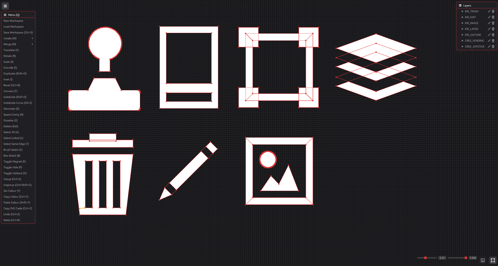

#  kricon

kricon is a purpose-built icon editing utility.

It exists because I wanted a tool to edit icons in a specific way that felt natural to me. After using both Adobe Illustrator and Blender extensively for this purpose, I found myself wanting a middle-ground between the two, with some additional features.

The single most powerful feature I wanted is to select a shape, copy it to the clipboard and be able to paste it into Figma, VS Code etc directly as SVG markup. No exporting, no converting; it just works.

The controls should feel familiar to anyone who's used Blender. Check out the controls list below for a full list of features.

##  Screenshots

<i>Screenshot of the kricon interface</i>

##  Download

	
	
	

Release versions of the tool are built automatically for <b>Windows</b>, <b>macOS</b> (Intel/Apple) and <b>Linux</b> from the latest source code and can be found on the [releases page](https://github.com/Kruithne/kricon/releases).

##  Controls

| Key | Action |
| --- | --- |
| `G` | Translates the selection. |
| `R` | Rotates the selection. |
| `S` | Scales the selection. |
| `Shift` + `S` | Subdivides the edges between the selected vertices. |
| `Alt` + `S` | Subdivides the edges between the selected vertices along a curve fitted to the neighbouring vertices. |
| `D` | Decimates the selected vertices. Removes every second vertex along each chain of selected vertices, the reverse of one subdivision. |
| `N` | Spaces the selected vertices evenly along each chain of selected vertices. The ends of each chain stay in place. |
| `X` / `Y` | Locks the current transform to the X or Y axis. |
| `N` | During a transform, locks the transform to the normal of the selected edges. |
| `Alt` | Snaps the translated selection to the grid while held. |
| `Shift` | Snaps the translated vertices to the X or Y of a nearby vertex while held. A guide line shows each snap. |
| `0`-`9` / `-` | Rotates by the typed angle in degrees. A negative angle rotates clockwise. |
| `Enter` | Confirms the current transform. |
| `Escape` | Cancels the current transform or closes the open menu. |
| `E` | Extrudes the selected vertices. |
| `Ctrl` + `B` | Bevels the selected corner vertices. Move the cursor away from the corners to increase the size. `Scroll` sets the number of segments. `Enter` or `Left Click` confirms, `Escape` or `Right Click` cancels. |
| `Shift` + `D` | Duplicates the selected vertices. The copy goes above the original in the layer order. |
| `F` | Connects the two selected vertices with an edge. |
| `V` | Adds a vertex at the cursor. |
| `Right Click` | Selects the vertex, face or image at the cursor. |
| `C` | Toggles brush selection. `Scroll` sets the size, `Left Click` selects and `Middle Click` deselects. |
| `K` | Toggles magnet mode. Translated vertices pull the nearby vertices with them. The pull fades out to the edge of the circle at the cursor. `Scroll` sets the size of the circle. |
| `B` | Starts box selection. Drag with `Left Click` to select the vertices in the box. |
| `A` | Selects all vertices. Deselects everything if something is already selected. |
| `L` | Adds all vertices linked to the vertex at the cursor to the selection. With no vertex at the cursor, selects all vertices linked to the selection. |
| `T` | Selects the edges that continue the path of the selected edges. For example, select one edge of an inset circle to select the full inner circle. |
| `Ctrl` + `S` | Saves the workspace. Asks for a file if the workspace has no file yet. |
| `Q` | Opens the menu of all actions at the cursor. The button in the top left also opens it. |
| `W` | Opens the create menu. |
| `Shift` + `Scroll` | Scales the new primitive before placement. `Scroll` sets the vertex count of a new circle or curve. |
| `M` | Opens the merge menu. |
| `X` | Dissolves the selected vertices and keeps the line between their neighbours. |
| `P` | Toggles a hole in the faces enclosed by the selected vertices. |
| `H` | Toggles holdout on the layers of the selected vertices. A holdout cuts through all faces below it in the layer order. Images are not cut. |
| `U` | Toggles sharp on the selected control points of a curve. A sharp point makes a corner in the curve. |
| `Ctrl` + `G` | Groups the layers of the selected vertices. The group shows in the layer stack and expands while its layers are selected. |
| `Ctrl` + `Shift` + `G` | Ungroups the groups that contain the selected vertices. |
| `Y` | Opens a colour palette at the cursor to set the colour of the selected faces. `Enter` or `Left Click` outside confirms, `Escape` cancels. |
| `Ctrl` + `Y` | Copies the colour of the selected face to the clipboard as a hex code. |
| `Shift` + `Y` | Sets the colour of the selected faces from a `#XXXXXX` or `#XXX` hex code in the clipboard. |
| `Delete` | Deletes the selection. |

##  Legal

kricon is licensed under the GNU General Public License v3.0 or later. See [LICENSE](LICENSE) for the full text.
